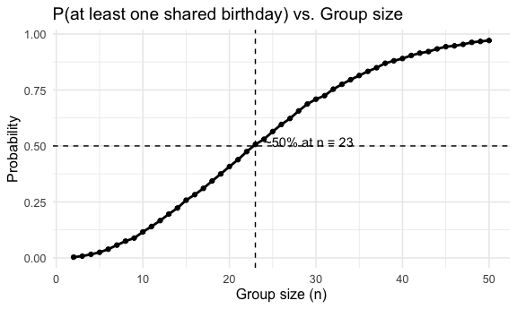
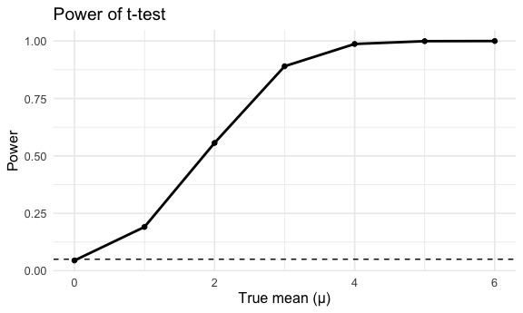
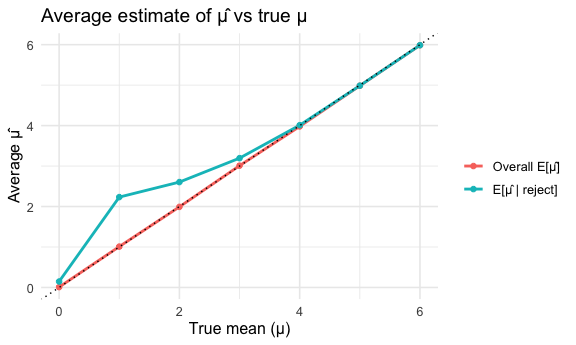

p8105_hw5_cw3747
================
chuhan wang_cw3747
2025-11-04

``` r
library(tidyverse)
```

    ## ── Attaching core tidyverse packages ──────────────────────── tidyverse 2.0.0 ──
    ## ✔ dplyr     1.1.4     ✔ readr     2.1.5
    ## ✔ forcats   1.0.0     ✔ stringr   1.5.1
    ## ✔ ggplot2   3.5.2     ✔ tibble    3.3.0
    ## ✔ lubridate 1.9.4     ✔ tidyr     1.3.1
    ## ✔ purrr     1.1.0     
    ## ── Conflicts ────────────────────────────────────────── tidyverse_conflicts() ──
    ## ✖ dplyr::filter() masks stats::filter()
    ## ✖ dplyr::lag()    masks stats::lag()
    ## ℹ Use the conflicted package (<http://conflicted.r-lib.org/>) to force all conflicts to become errors

``` r
library(patchwork)
library(scales)
```

    ## 
    ## Attaching package: 'scales'
    ## 
    ## The following object is masked from 'package:purrr':
    ## 
    ##     discard
    ## 
    ## The following object is masked from 'package:readr':
    ## 
    ##     col_factor

``` r
library(dplyr)


knitr::opts_chunk$set(
  fig.width = 6,
  fig.asp = .6,
  out.width = "90%"
)

theme_set(theme_minimal() + theme(legend.position = "bottom"))

options(
  ggplot2.continuous.colour = "viridis",
  ggplot2.continuous.fill = "viridis"
)

scale_colour_discrete = scale_colour_viridis_d
scale_fill_discrete = scale_fill_viridis_d
```

## Problem1

### Birthday Function

``` r
library(ggplot2)
library(dplyr)

set.seed(123)


birthday_dup <- function(n, days = 365) {
  bdays <- sample.int(days, n, replace = TRUE) 
  any(duplicated(bdays))                       
}
```

### iteration

``` r
simulate_prob <- function(n, B = 10000, days = 365) {
  mean(replicate(B, birthday_dup(n, days)))
}

ns <- 2:50
B  <- 10000

probs <- numeric(length(ns))
for (i in seq_along(ns)) {
  probs[i] <- simulate_prob(ns[i], B = B)
}

df_loop <- data.frame(n = ns, p = probs)

n50_loop <- min(df_loop$n[df_loop$p >= 0.5])
```

### ggplot

``` r
ggplot(df_loop, aes(n, p)) +
  geom_line(linewidth = 1) +
  geom_point(size = 1.5) +
  geom_hline(yintercept = 0.5, linetype = 2) +
  geom_vline(xintercept = n50_loop, linetype = 2) +
  annotate("text", x = n50_loop + 1, y = 0.52,
           label = paste0("~50% at n = ", n50_loop), hjust = 0) +
  labs(title = "P(at least one shared birthday) vs. Group size",
       x = "Group size (n)", y = "Probability") +
  theme_minimal(base_size = 12)
```



The plot shows that the probability of at least one shared birthday
increases rapidly with group size. Around n = 23, the probability
reaches about 0.5, meaning that in a random group of 23 people there is
50% chance that some pair shares a birthday (this does not mean that
“half of the people” have a match). As n approaches 50, the probability
nears 1, implying that a shared-birthday pair is almost guaranteed,
though not that everyone finds a match. Real-world seasonality and
clustering can shift the curve slightly, but the qualitative “birthday
paradox” pattern remains.

## Problem2

### set function

``` r
library(broom) 

set.seed(123)

sim_once <- function(mu, n = 30, sigma = 5) {
  x  <- rnorm(n, mean = mu, sd = sigma)
  tt <- t.test(x, mu = 0)
  tibble(
    mu = mu,
    mu_hat = mean(x),
    p = tidy(tt)$p.value,
    reject = p < 0.05
  )
}
```

### iteration

``` r
simulate_mu <- function(mu, B = 5000, n = 30, sigma = 5) {
  bind_rows(replicate(B, sim_once(mu, n, sigma), simplify = FALSE))
}
```

### for different $\mu$

``` r
mus <- 0:6
res_list <- vector("list", length(mus))
for (i in seq_along(mus)) {
  res_list[[i]] <- simulate_mu(mus[i], B = 5000)
}
res <- bind_rows(res_list)
```

### power of test

``` r
summ <- res |>
  group_by(mu) |>
  summarise(
    power = mean(reject),
    avg_mu_hat_all = mean(mu_hat),
    avg_mu_hat_rej = mean(mu_hat[reject]),
    .groups = "drop"
  )

ggplot(summ, aes(mu, power)) +
  geom_line(linewidth = 1) +
  geom_point(size = 1.6) +
  geom_hline(yintercept = 0.05, linetype = 2) +
  labs(title = "Power of t-test",
       x = "True mean (μ)", y = "Power") +
  theme_minimal(base_size = 12)
```



We fix $\mu_0 = 0$ and $\sigma = 5$. The effect size is
$d = (\mu - \mu_0) / \sigma$. Hence, larger $\mu$ implies a larger
effect size. The plot shows that power increases monotonically with
$\mu$: at $\mu$ = 0, the the rejection rate is about the rejection rate
is about $\alpha$ = 0.05; as $\mu$ grows, power rises quickly. Larger
effect size makes the sample mean more distinct from 0, yielding a
larger absolute t-statistic and a higher chance of rejecting the null.

### average estimate

``` r
summ_long <- summ |>
  pivot_longer(-mu, names_to = "metric", values_to = "value") |>
  filter(metric %in% c("avg_mu_hat_all","avg_mu_hat_rej"))

ggplot(summ_long, aes(mu, value, color = metric)) +
  geom_line(linewidth = 1) +
  geom_point(size = 1.6) +
  geom_abline(slope = 1, intercept = 0, linetype = 3) +
  scale_color_discrete(labels = c("Overall E[μ̂]", "E[μ̂ | reject]")) +
  labs(title = "Average estimate of μ̂ vs true μ",
       x = "True mean (μ)", y = "Average μ̂", color = "") +
  theme_minimal(base_size = 12)
```



The sample average of $\hat{\mu}$ among tests that reject $H_0$ is not
approximately equal to the true $\mu$. We can see from the plot, when
the $\mu$ is around 1, conditioning on significance selects extreme
estimates, so the $\hat{\mu}$ shifted away from 0. It’s like a form of
selection bias. Only when the power is very high so that almost all
samples reject $H_0$, $\mu$ and $\hat{\mu}$ are close.

## Problem3

### data import

``` r
homicide = read_csv("./homicide-data.csv") |>
  janitor::clean_names() |>
  mutate(reported_date = ymd(reported_date))
```

    ## Rows: 52179 Columns: 12
    ## ── Column specification ────────────────────────────────────────────────────────
    ## Delimiter: ","
    ## chr (9): uid, victim_last, victim_first, victim_race, victim_age, victim_sex...
    ## dbl (3): reported_date, lat, lon
    ## 
    ## ℹ Use `spec()` to retrieve the full column specification for this data.
    ## ℹ Specify the column types or set `show_col_types = FALSE` to quiet this message.

    ## Warning: There was 1 warning in `mutate()`.
    ## ℹ In argument: `reported_date = ymd(reported_date)`.
    ## Caused by warning:
    ## !  2 failed to parse.

### describe

``` r
glimpse(homicide)
```

    ## Rows: 52,179
    ## Columns: 12
    ## $ uid           <chr> "Alb-000001", "Alb-000002", "Alb-000003", "Alb-000004", …
    ## $ reported_date <date> 2010-05-04, 2010-02-16, 2010-06-01, 2010-01-01, 2010-01…
    ## $ victim_last   <chr> "GARCIA", "MONTOYA", "SATTERFIELD", "MENDIOLA", "MULA", …
    ## $ victim_first  <chr> "JUAN", "CAMERON", "VIVIANA", "CARLOS", "VIVIAN", "GERAL…
    ## $ victim_race   <chr> "Hispanic", "Hispanic", "White", "Hispanic", "White", "W…
    ## $ victim_age    <chr> "78", "17", "15", "32", "72", "91", "52", "52", "56", "4…
    ## $ victim_sex    <chr> "Male", "Male", "Female", "Male", "Female", "Female", "M…
    ## $ city          <chr> "Albuquerque", "Albuquerque", "Albuquerque", "Albuquerqu…
    ## $ state         <chr> "NM", "NM", "NM", "NM", "NM", "NM", "NM", "NM", "NM", "N…
    ## $ lat           <dbl> 35.09579, 35.05681, 35.08609, 35.07849, 35.13036, 35.151…
    ## $ lon           <dbl> -106.5386, -106.7153, -106.6956, -106.5561, -106.5810, -…
    ## $ disposition   <chr> "Closed without arrest", "Closed by arrest", "Closed wit…

``` r
count(homicide, disposition, sort = TRUE)
```

    ## # A tibble: 3 × 2
    ##   disposition               n
    ##   <chr>                 <int>
    ## 1 Closed by arrest      25674
    ## 2 Open/No arrest        23583
    ## 3 Closed without arrest  2922

``` r
count(homicide, city, state, sort = TRUE) |> head(10)
```

    ## # A tibble: 10 × 3
    ##    city         state     n
    ##    <chr>        <chr> <int>
    ##  1 Chicago      IL     5535
    ##  2 Philadelphia PA     3037
    ##  3 Houston      TX     2942
    ##  4 Baltimore    MD     2827
    ##  5 Detroit      MI     2519
    ##  6 Los Angeles  CA     2257
    ##  7 St. Louis    MO     1677
    ##  8 Dallas       TX     1567
    ##  9 Memphis      TN     1514
    ## 10 New Orleans  LA     1434

``` r
n_rows   <- nrow(homicide)
n_cols   <- ncol(homicide)
n_cities <- dplyr::n_distinct(homicide$city)
n_states <- dplyr::n_distinct(homicide$state)

date_min <- suppressWarnings(min(homicide$reported_date, na.rm = TRUE))
date_max <- suppressWarnings(max(homicide$reported_date, na.rm = TRUE))

unsolved_flag <- homicide$disposition %in% c("Closed without arrest","Open/No arrest")
n_unsolved    <- sum(unsolved_flag, na.rm = TRUE)

top_cities <- homicide |>
  count(city, state, sort = TRUE) |>
  mutate(city_state = paste0(city, ", ", state)) |>
  slice_head(n = 5)
```

The raw homicide dataset contains 52179 observations and 12 variables
collected from 50 cities across 28 states. The data span from 2007-01-01
to 2017-12-31. And treating “Closed without arrest” and “Open/No arrest”
as unsolved, there are 26505 unsolved cases of all records. Cities with
the most cases include Chicago, IL (5535), Philadelphia, PA (3037), and
Houston, TX (2942).
